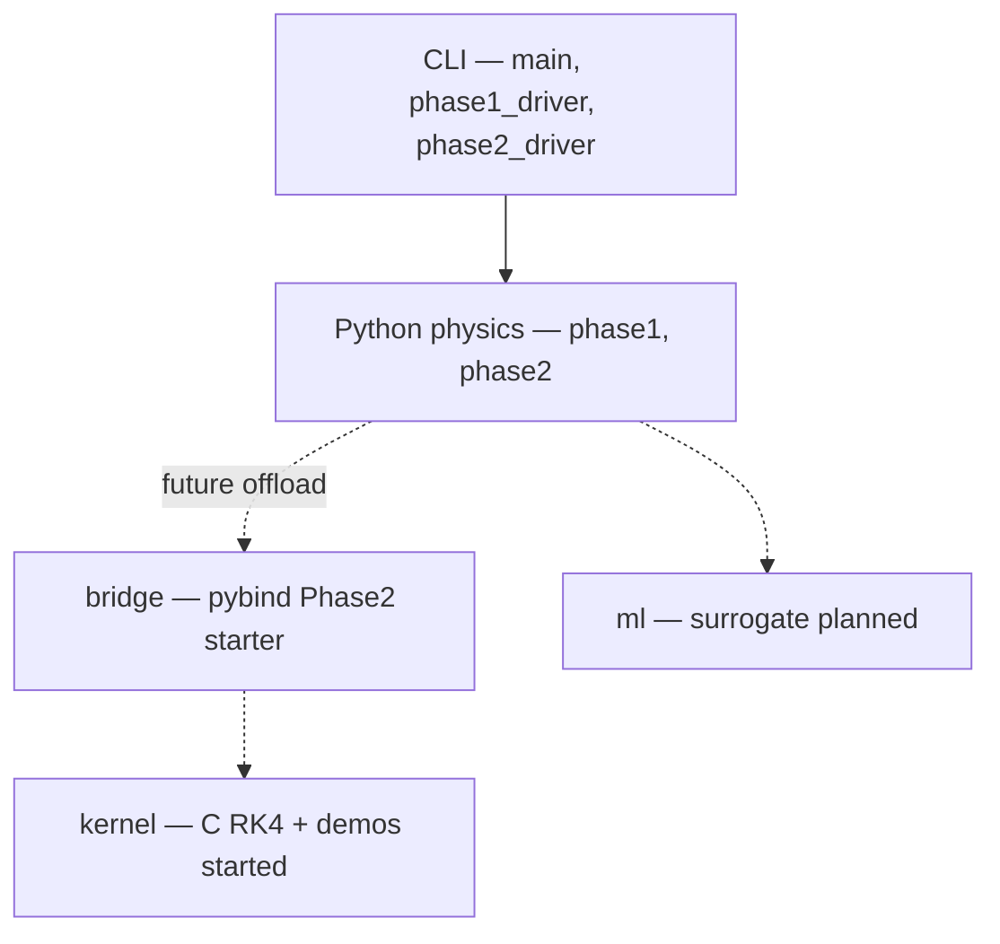

# Project overview — blackhole_ray_tracer

## Purpose

Simulate **null geodesics** (light rays) in strong gravity, starting from **Schwarzschild** and evolving toward **Kerr** / production performance. Architecture goal: move heavy integration into **C** (SIMD-friendly) or **GPU** while **Python** handles presets, orchestration, tests, ML tooling, and fast prototypes.

See also: [ROADMAP.md](./ROADMAP.md) for phases and acceptance criteria, [AGENT_PROMPT.md](./AGENT_PROMPT.md) for per-session starters, [STATE_API.md](./STATE_API.md) for draft FFI / SoA rays, **`.cursorrules`** (repo root) for Cursor persistent rules.

## What exists today vs planned

### Implemented (Python)

Under `src/blackhole_ray_tracer/`:

| Area | Modules | Role |
|------|-----------|------|
| **Phase 1** | `phase1.py`, `phase1_driver.py`, `phase1_image.py`, `phase1_tuning.py` | RK4 sanity (harmonic oscillator), equatorial Schwarzschild tracing in \(u(\phi)=1/r\), single ray logging, batch impact-parameter sweeps, simple **Einstein ring**–style PPM, tuning presets/report |
| **Phase 2** | `phase2_*.py` | Spherical Schwarzschild **Christoffel + RK4** in affine parameter \((x^\mu,v^\mu)\); static observer **pinhole** camera; **3D shadow** PPM via per-pixel rays; presets/benchmark (`phase2_report.py`), driver CLI |
| **Entry** | `main.py` (`blackhole-ray-tracer` console script), `phase1_driver`, `phase2_driver` module entrypoints | User-facing CLI |
| **Bridge (optional)** | `native_phase2.py`, extension `_native_phase2` from [`bridge/`](../bridge/README.md) | PyBind11 call into `bh_rt_schwarzschild_phase2_trace`; skip if wheel built without compilers |
| **Tests** | `tests/test_phase1_extensions.py`, `tests/test_phase2.py`, kernel + bridge skips | Regression / smoke |

Tooling: `pyproject.toml` — `uv` for env/lockfile; dependency group `dev` has `pytest`, `ruff`, `mypy`.

### Planned / scaffold only (verify before assuming implementation)

Directories **`kernel/`**, **`bridge/`**, and **`ml/`** are described in the README as the long-term split (pure C integration, pybind11 bridge, ML surrogate pipeline). **`kernel/`** hosts the **RK4** core, Phase A harmonic + Schwarzschild \(u(\phi)\), and Schwarzschild **Phase 3D** Christoffel trace (see roadmap). **`bridge/`** now builds `blackhole_ray_tracer._native_phase2`, which wraps **`bh_rt_schwarzschild_phase2_trace`**. **`ml/`** is still scaffold-only until Phase 3.

High-level layering:



## Conventions and strategy

- **Units:** Geometric units \(G = c = 1\); Schwarzschild radius \(r_s = 2M\).
- **Future Kerr:** Target **Boyer–Lindquist** coordinates so Schwarzschild is the \(a \to 0\) limit of one code path.
- **Performance direction:** **SoA** (arrays of `r[]`, `phi[]`, …) for SIMD; **early exit** when \(r < r_\text{horizon}+\epsilon\) or \(r > r_\text{escape}\).
- **Phase discipline:** New experiment layers should stay in clear modules (`phaseN_*` or future `kernel/`) rather than growing one monolith.

## Development commands

```bash
uv sync
uv sync --group dev   # pytest, ruff, mypy

uv run blackhole-ray-tracer --help
uv run pytest
uv run ruff check src tests
uv run mypy src       # after dev group
```

## Primary file map (quick reference)

| Path | Notes |
|------|--------|
| `src/blackhole_ray_tracer/main.py` | `blackhole-ray-tracer` script; Phase 1 + Phase 2 flags |
| `src/blackhole_ray_tracer/phase1.py` | Shared `rk4_step`, equatorial ray trace, batch helpers |
| `src/blackhole_ray_tracer/phase1_driver.py` | Phase 1 steps A–F with argparse |
| `src/blackhole_ray_tracer/phase1_image.py` | PPM I/O; Einstein-ring render |
| `src/blackhole_ray_tracer/phase1_tuning.py` | Phase 1 presets / benchmark |
| `src/blackhole_ray_tracer/phase2_christoffel.py` | Schwarzschild Christoffel / ODE RHS |
| `src/blackhole_ray_tracer/phase2_geodesic.py` | 3D null RK4 tracer |
| `src/blackhole_ray_tracer/phase2_camera.py` | Static observer pinhole → initial null 4-velocity |
| `src/blackhole_ray_tracer/phase2_types.py` | `Phase2RenderConfig`, camera, trace result types |
| `src/blackhole_ray_tracer/phase2_render.py` | Per-pixel pinhole image loop; optional **`use_native_phase2`** → `_native_phase2` |
| `src/blackhole_ray_tracer/phase2_report.py` | Phase 2 presets + benchmark text |
| `src/blackhole_ray_tracer/phase2_driver.py` | Phase 2 `--render` / `--report` CLI |
| `kernel/include/bh_rt_rk4.h`, `kernel/src/bh_rt_rk4.c` | Shared C **RK4** step (no Python) |
| `kernel/include/bh_rt_schwarzschild_u.h`, `kernel/src/bh_rt_schwarzschild_u.c` | Schwarzschild 2D \(u(\phi)=1/r\) ray trace (parity with `phase1.py`) |
| `kernel/include/bh_rt_schwarzschild_phase2.h`, `kernel/src/bh_rt_schwarzschild_phase2.c` | Schwarzschild **3D** null tracer (Christoffel + RK4; parity with `phase2_geodesic.py`) |
| `kernel/src/demo_harmonic.c`, `kernel/src/demo_schwarzschild_u.c`, `kernel/Makefile` | RK4 + Schwarzschild CLI demos (`make -C kernel`) |
| `bridge/module_phase2.cpp`, `MANIFEST.in`, `setup.py` | setuptools + PyBind11 extension `_native_phase2` embedding `bh_rt_*` sources |
| `src/blackhole_ray_tracer/native_phase2.py` | Optional import façade + `native_phase2_available()` |
| `kernel/README.md` | Kernel build and next steps |
| `bridge/README.md` | Bridge directory rules and naming |
